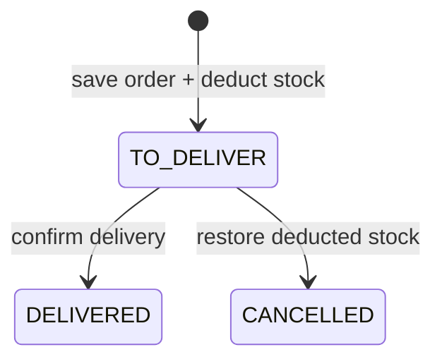
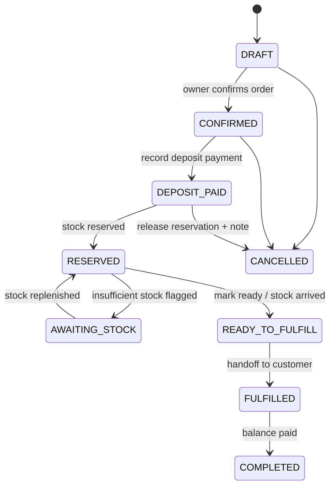

# Order Notebook App — Project Specification

Status: Approved requirements baseline (pending stakeholder review)  
Version: 1.6
Date: 2026-07-27  
Primary market: Myanmar (MMK, English + Myanmar UI)

## 1. Project overview

Order Notebook is a **multi-tenant SaaS** shop management platform for Myanmar small and medium businesses that sell through messenger and social channels. Staff record orders on behalf of customers, track inventory, manage customer relationships, monitor sales, and fulfill **advance/pre-orders** with deposit and balance collection.

The product is **staff-only** in version one. There is no customer-facing portal, storefront, or self-service checkout. The **web app is the active client priority**; mobile implementation is intentionally deferred to a later phase while the shared versioned API remains reusable for it.

A distinguishing capability is an **AI-powered order-drafting assistant**: staff paste or type messenger-style messages, and the assistant proposes structured order drafts (customer, line items, quantities, notes) for human review before saving. Each shop brings its own LLM API key (**BYOK**).

### 1.1 Problem statement

Myanmar shops often manage orders in notebooks, spreadsheets, and chat threads. Deposits, partial payments, stock reservations, and fulfillment dates are easy to lose. Order Notebook replaces fragmented manual tracking with one bilingual system that respects how messenger-led sales actually work.

### 1.2 Product decisions

| Decision | Approved outcome |
| --- | --- |
| Product type | Multi-tenant SaaS shop management |
| Primary users | Shop owners (v1 single role per shop) |
| End customers | Not system users in v1; staff enter orders on their behalf |
| Tenancy | Many independent shops; strict tenant data isolation |
| Shop onboarding | Self-serve signup (owner registers and creates shop) |
| Platform administration | Minimal internal ops/support admin (not exposed to shop owners) |
| Currency | MMK only |
| Locales | English and Myanmar; Myanmar-first UX copy; English fallback |
| Themes | Light and dark with toggle (web and mobile) |
| Order channels (v1) | Messenger / social-led orders (recorded with channel metadata) |
| Pre-order model | Deposit → reserve stock → fulfill on arrival → collect balance |
| Payments (v1) | Manual payment recording; partial payments and deposits |
| Payment gateway | Out of scope v1; architecture allows future integration |
| Inventory (v1) | Simple catalog: name, SKU, price, stock qty, category, image |
| CRM (v1) | Basic: name, phone, address, notes, order history |
| AI assistant (v1) | Draft orders from natural language; human confirmation required |
| AI provider | BYOK per shop (encrypted API key storage) |
| Staff roles (v1) | Owner only (full shop access) |
| Client platforms (current phase) | Web-first; mobile deferred to later phases |
| Project layout | Independent `frontend/`, `backend/`, and `mobile/` projects (no monorepo) |
| Web stack | React, Vite, TypeScript, React Query, React Router, React Hook Form, shadcn/ui, Tailwind, JWT |
| Backend stack | Express, TypeScript, Prisma, SQLite (local/test), PostgreSQL (production), JWT, API versioning |
| Mobile stack | React Native, Expo, Expo Router, Expo UI, React Query, React Hook Form |

## 2. Goals and success measures

### 2.1 Goals

1. Let a shop owner register and start recording messenger orders in under 15 minutes.
2. Reduce lost or duplicate pre-orders through a clear deposit → reserve → fulfill → balance workflow.
3. Keep product stock accurate for simple catalogs without enterprise ERP complexity.
4. Give owners a single customer view (contact info, notes, order history).
5. Surface actionable sales and pre-order pipeline reports without spreadsheet exports as the default workflow.
6. Speed up order entry with AI-drafted orders that staff always review before saving.
7. Deliver the core workflows on a mobile-first responsive web console with Myanmar-first bilingual support; bring mobile parity in a later phase.

### 2.2 Initial success measures

- Shop activation rate (signup → first product → first order) within 7 days.
- Median time to create an order (with and without AI assist).
- Pre-order fulfillment SLA adherence (fulfilled by expected date).
- Deposit/balance reconciliation errors (orders where recorded payments ≠ expected totals).
- AI draft acceptance rate (draft saved without manual line-item rewrite).
- Weekly active shops and orders per active shop.
- API error rate and p95 latency for core order endpoints.
- No critical security defects in tenant isolation or auth flows.

Baseline targets will be set after 30 days of pilot usage.

## 3. Scope

### 3.1 Version-one scope

**Platform & tenancy**

- Self-serve owner registration and shop creation.
- JWT authentication with register, login, verify, refresh, logout.
- Tenant-scoped data for all shop resources.
- Minimal internal platform admin API/UI for ops (tenant lookup, suspend shop, support notes) — not marketed to shop owners.

**Catalog & inventory**

- Product CRUD with SKU, price (MMK), stock quantity, category, optional image.
- Low-stock indicator (configurable threshold per product).
- Manual stock adjustments with reason (sale, return, damage, correction, pre-order reservation).
- Stock reservation on pre-order deposit confirmation.

**Customers (CRM)**

- Customer CRUD: name, phone (required), optional address and notes.
- Duplicate detection hint on phone number within shop.
- Customer detail: order history, total spent, open pre-orders, notes timeline.

**Orders**

- Standard immediate orders and pre-orders (advance orders).
- Line items with product snapshot (name, SKU, unit price at time of order).
- Order status workflow (see §8).
- Messenger/social channel tag and free-text reference (thread name, page, link note).
- Manual payment entries: amount, method, note, timestamp.
- Deposit and balance tracking for pre-orders.
- Order search and filters (status, date range, customer, channel, pre-order only).

**Pre-orders**

- Expected arrival/fulfillment date (optional but encouraged).
- Deposit amount at creation or before reservation.
- Reserve stock on deposit confirmation.
- Notify-ready state when stock available (in-app indicator; push deferred).
- Fulfillment marks items delivered; balance due surfaced before completion.

**AI assistant**

- Per-shop encrypted BYOK configuration (provider enum + API key).
- Chat UI: staff pastes messenger text or describes order in natural language (EN or MY).
- Assistant returns structured **draft** (customer match suggestions, line items, quantities, notes).
- Staff edits draft, then explicitly confirms save — no silent auto-commit.
- AI does not access other shops' data; context limited to current shop catalog and customers.

**Reporting (recommended MVP set — stakeholder deferred specifics)**

- Daily / weekly / monthly sales totals (MMK).
- Top products by revenue and quantity.
- Pre-order pipeline: deposits received, reserved, awaiting stock, ready to fulfill, balances outstanding.
- Payment method breakdown.
- CSV export for orders and sales summary.

**Clients**

- Web: mobile-first responsive staff console, scaling to tablet and desktop.
- Mobile: Expo app is deferred to a later phase; preserve API and domain contracts for subsequent parity work.
- English/Myanmar toggle and light/dark theme on the web; extend to mobile when that phase resumes.

**Technical**

- Versioned REST API at `/api/v1`.
- Prisma migrations (PostgreSQL canonical; SQLite for local dev and automated tests).
- Automated unit and integration tests on backend; baseline tests on the web. Mobile tests and parity are deferred with the mobile phase.

### 3.2 Explicitly out of scope for version one

- Customer self-service portal, public storefront, or online checkout.
- Payment gateway integration (KBZPay, Wave, card, etc.).
- Multi-currency or FX conversion.
- Product variants (size/color) and multi-location inventory.
- Additional staff roles (cashier, warehouse, read-only accountant) — architecture prepares RBAC extension.
- Platform super-admin self-service for shop owners.
- SMS/push notifications (in-app badges only).
- Barcode/label printing, receipt printers, fiscal compliance.
- Shipping carrier integration and live tracking.
- Offline-first mobile sync (online-required v1; design for future queue).
- AI auto-execution without human confirmation.
- AI access to aggregated cross-tenant analytics.

### 3.3 Future scope (separate requirements cycle)

- Staff roles and permissions (cashier, fulfillment, accountant).
- Branch / multi-warehouse inventory.
- Customer notification templates (SMS, Messenger webhooks).
- Payment gateway and reconciliation ledger.
- Purchase orders and supplier management.
- Platform billing and subscription plans.
- Advanced CRM (segments, reminders, campaigns).
- Offline mobile order queue.

## 4. Users, roles, and permissions

### 4.1 Roles

#### Platform operator (internal)

Minimal ops/support role. Not available to shop owners.

- List/search tenants and shops.
- Suspend or reactivate a shop.
- View redacted support metadata (no customer PII bulk export without audit).
- Rotate platform secrets; no access to shop BYOK keys in plaintext.

#### Shop owner (v1 sole shop role)

One owner account per shop in v1. Full access within their tenant.

- Manage shop profile and settings (including AI BYOK).
- Full product, customer, order, payment, and report access.
- Use AI order assistant.
- Export reports.

#### System process

- Enforce tenant isolation, JWT verification, stock reservation rules, and audit logging.

### 4.2 Version-one permission matrix

| Capability | Shop owner | Platform operator | System |
| --- | :---: | :---: | :---: |
| Register / create shop | Yes | No | Provision |
| Manage products & stock | Yes | No | Enforce rules |
| Manage customers | Yes | No | — |
| Create/edit orders & payments | Yes | No | — |
| View shop reports | Yes | No | Aggregate metrics |
| Configure AI BYOK | Yes | No | Encrypt at rest |
| Suspend shop | No | Yes | — |
| Cross-tenant data access | No | Redacted ops only | Audit |

### 4.3 Authentication model

- **Shop users**: JWT access + refresh; `tenantId` and `shopId` claims on token after shop context established.
- **Platform operators**: Separate auth realm or elevated claims; not combinable with shop owner session in v1 UI.
- Registration flow: user account → create shop (tenant) → owner linked as `ShopMember` with role `OWNER`.
- All shop-scoped API routes require valid JWT + tenant membership middleware.

## 5. Functional requirements

### 5.1 Shop onboarding

| ID | Requirement |
| --- | --- |
| ONB-01 | Owner can register with email and password. |
| ONB-02 | Owner creates shop with name, optional phone, optional address. |
| ONB-03 | Shop receives unique `slug` for internal reference (not public storefront). |
| ONB-04 | Post-onboarding checklist: add first product, add first customer, create first order. |
| ONB-05 | Owner can update shop settings and MMK display preferences. |

### 5.2 Product catalog

| ID | Requirement |
| --- | --- |
| CAT-01 | CRUD products with name, SKU (unique per shop), unit price (MMK integer), stock qty, category, optional image URL/upload. |
| CAT-02 | List/search products by name, SKU, category; filter low stock. |
| CAT-03 | Soft-delete or archive products; archived products not selectable on new orders but visible on historical orders. |
| CAT-04 | Manual stock adjustment records reason, quantity delta, optional note, actor, timestamp. |
| CAT-05 | Prevent negative stock on standard sales unless shop setting `allowOversell` enabled (default false). |
| CAT-06 | Product list responses expose sellable `availableStock` (on-hand stock less reservations) for stock-aware order entry. |
| CAT-07 | Product list responses expose tenant-scoped delivered-sales summaries (`soldQuantity`, `salesRevenueMMK`) for compact catalog cards. |

### 5.3 Customers (CRM)

| ID | Requirement |
| --- | --- |
| CRM-01 | CRUD customers with name, phone (required), address, notes. |
| CRM-02 | Warn on duplicate phone within shop on create. |
| CRM-03 | Customer detail shows paginated order history, lifetime spend, open pre-order count. |
| CRM-04 | Append timestamped notes to customer (optional v1.1 if not in initial cut). |
| CRM-05 | Customer list responses include the latest non-cancelled order summary for compact cards and repeat-order entry. |

### 5.4 Orders (standard)

| ID | Requirement |
| --- | --- |
| ORD-01 | Create order with customer (existing or quick-create), line items, channel = `MESSENGER`, optional channel reference text. |
| ORD-02 | Compute subtotal, discounts (fixed MMK v1), total. |
| ORD-03 | Record one or more payments; track `amountPaid` vs `totalDue`. |
| ORD-04 | Standard orders are created directly as `TO_DELIVER`, then transition to `DELIVERED` or `CANCELLED`; no draft, confirmation, or required delivering stage is exposed in the standard staff workflow. |
| ORD-05 | Creating a standard order decrements stock atomically; insufficient stock rolls back the entire order creation. |
| ORD-06 | Cancelling order releases reservations and reverses stock if already decremented (with audit). |
| ORD-07 | Store delivery recipient snapshot fields separately at order time: `customerName`, `customerPhone`, `townshipOrCity`, `detailedAddress`, and optional `addressLabel`. Order detail UI provides **Copy Delivery Info** that copies `[customerName]\n[customerPhone]\n[detailedAddress], [townshipOrCity]` to clipboard for third-party delivery app handoff. |

### 5.5 Pre-orders (advance orders)

| ID | Requirement |
| --- | --- |
| PRE-01 | Order `type` = `PREORDER` with expected fulfillment date (optional). |
| PRE-02 | Require deposit (configurable minimum: fixed MMK or % of total; default > 0 for pre-orders). |
| PRE-03 | On deposit recorded: status → `DEPOSIT_PAID`; reserve stock for line items. |
| PRE-04 | Status `RESERVED` when stock locked; `AWAITING_STOCK` if reservation partial or backordered (v1: flag only, no supplier PO). |
| PRE-05 | Status `READY_TO_FULFILL` when stock available and owner marks ready (or auto when reserved qty satisfied). |
| PRE-06 | Fulfillment records delivery/handoff; status → `FULFILLED`; surface `balanceDue`. |
| PRE-07 | On final balance payment: status → `COMPLETED`. |
| PRE-08 | Cancellation rules: deposit forfeiture note field; release reservations; optional partial refund payment record. |

### 5.6 Payments

| ID | Requirement |
| --- | --- |
| PAY-01 | Payment arrangements/methods enum: `CASH`, `COD`, `BANK_TRANSFER`, `KBZPAY_MANUAL`, `WAVE_MANUAL`, `OTHER` (manual recording only). |
| PAY-02 | Payments immutable after create; corrections via reversing entry + new payment (audit trail). |
| PAY-03 | Support multiple partial payments per order. |
| PAY-04 | Display deposit, total paid, balance due on order detail. |
| PAY-05 | Derive payment status independently from fulfillment: `UNPAID`, `PARTIALLY_PAID`, or `PAID`. A `COD` order remains `UNPAID` until collection is recorded as a payment. |

### 5.7 AI order assistant

| ID | Requirement |
| --- | --- |
| AI-01 | Shop owner configures provider (`OPENAI`, `ANTHROPIC`, `OTHER`) and API key; key encrypted at rest. |
| AI-02 | Chat session per drafting flow; messages stored for audit (retention policy configurable). |
| AI-03 | User submits free-text; backend calls LLM with shop-scoped tool context: product list (name, SKU, price, stock), customer search by phone/name fragment. |
| AI-04 | Response is `OrderDraft` JSON: suggested `customerId` or `newCustomer`, `lineItems[]`, `notes`, `confidence` hints. |
| AI-05 | UI renders editable draft form (React Hook Form); user must tap **Confirm order** to persist. |
| AI-06 | Never call LLM without tenant context; never include other tenants' data in prompt. |
| AI-07 | Graceful degradation when key missing or provider error (manual order entry always available). |

### 5.8 Reporting

| ID | Requirement |
| --- | --- |
| RPT-01 | Sales summary for day/week/month with order count and revenue. |
| RPT-02 | Top N products by revenue and quantity for selected period. |
| RPT-03 | Pre-order pipeline counts and deposit/balance totals by status. |
| RPT-04 | Payment method breakdown for period. |
| RPT-05 | Export orders CSV for date range (owner only). |

### 5.9 Localization & theme

| ID | Requirement |
| --- | --- |
| L10N-01 | All user-visible strings in `en` and `my` resource files (web, mobile, API error messages). |
| L10N-02 | User-selectable language; persist preference; fallback `en`. |
| L10N-03 | MMK formatting: whole integers with `K`/`Lakh` display option in UI (configurable). |
| THM-01 | Light/dark theme toggle; persist per device. |

## 6. Non-functional requirements

### 6.1 Security

- Strict tenant isolation on every query (`shopId` from JWT, never from client body alone).
- Passwords hashed with modern algorithm (bcrypt or argon2).
- JWT: pinned algorithm, short-lived access token, refresh rotation.
- Encrypt shop AI API keys at rest (AES-256-GCM or KMS equivalent).
- HTTPS only in production; secure mobile token storage (`expo-secure-store`).
- Rate-limit auth and AI endpoints.
- Audit log for order status changes, payments, stock adjustments, and AI draft confirmations.

### 6.2 Performance

- p95 API latency < 300ms for catalog and order list at 10k products / 50k orders per shop (indexed queries).
- AI draft request timeout 30s with async job option if needed in v1.1.
- Web LCP < 2.5s on mid-range devices; mobile cold start acceptable per Expo baseline.

### 6.3 Reliability

- PostgreSQL backups daily; point-in-time recovery in production.
- Idempotent payment creation via client `Idempotency-Key` header (recommended).
- Optimistic locking on stock updates to prevent double reservation.

### 6.4 Accessibility

- WCAG 2.1 AA target for web staff console.
- Minimum touch targets and screen reader labels on mobile.

### 6.5 Compliance & privacy

- Shop owns customer data; platform acts as processor.
- Data export and shop deletion workflow documented (GDPR-style deletion in future milestone).
- AI prompts must not log full API keys; redact in application logs.

## 7. Data model and database schema

All shop-owned tables include `shopId` (tenant key). PostgreSQL is canonical; SQLite schema mirrors for local dev.

### 7.1 Entity relationship summary

```text
User ──< ShopMember >── Shop (tenant)
Shop ──< Product, Category, Customer, Order, AiConfig, ChatSession
Customer ──< Order
Order ──< OrderLineItem, Payment, OrderStatusHistory
Product ──< OrderLineItem (snapshot fields denormalized)
Order ── optional link ── ChatSession (if created via AI)
```

### 7.2 Core Prisma models (conceptual)

```prisma
enum ShopMemberRole {
  OWNER
  // future: MANAGER, CASHIER, FULFILLMENT, READONLY
}

enum OrderType {
  STANDARD
  PREORDER
}

enum OrderStatus {
  DRAFT
  CONFIRMED
  DEPOSIT_PAID
  RESERVED
  AWAITING_STOCK
  READY_TO_FULFILL
  FULFILLED
  COMPLETED
  CANCELLED
}

enum PaymentMethod {
  CASH
  BANK_TRANSFER
  KBZPAY_MANUAL
  WAVE_MANUAL
  OTHER
}

enum OrderChannel {
  MESSENGER
  PHONE
  IN_PERSON
  OTHER
}

model User {
  id           String   @id @default(cuid())
  email        String   @unique
  passwordHash String
  name         String
  createdAt    DateTime @default(now())
  updatedAt    DateTime @updatedAt
  memberships  ShopMember[]
}

model Shop {
  id              String   @id @default(cuid())
  slug            String   @unique
  name            String
  phone           String?
  address         String?
  allowOversell   Boolean  @default(false)
  preorderDepositMinPct Int?  @default(30)
  status          ShopStatus @default(ACTIVE)
  createdAt       DateTime @default(now())
  updatedAt       DateTime @updatedAt
  members         ShopMember[]
  products        Product[]
  categories      Category[]
  customers       Customer[]
  orders          Order[]
  aiConfig        AiConfig?
}

model ShopMember {
  id        String         @id @default(cuid())
  shopId    String
  userId    String
  role      ShopMemberRole @default(OWNER)
  shop      Shop           @relation(fields: [shopId], references: [id])
  user      User           @relation(fields: [userId], references: [id])
  @@unique([shopId, userId])
}

model Category {
  id        String   @id @default(cuid())
  shopId    String
  name      String
  sortOrder Int      @default(0)
  shop      Shop     @relation(fields: [shopId], references: [id])
  products  Product[]
  @@unique([shopId, name])
}

model Product {
  id          String   @id @default(cuid())
  shopId      String
  categoryId  String?
  sku         String
  name        String
  priceMMK    Int
  stockQty    Int      @default(0)
  reservedQty Int      @default(0)
  lowStockAt  Int?
  imageUrl    String?
  isArchived  Boolean  @default(false)
  shop        Shop     @relation(fields: [shopId], references: [id])
  category    Category? @relation(fields: [categoryId], references: [id])
  @@unique([shopId, sku])
}

model Customer {
  id        String   @id @default(cuid())
  shopId    String
  name      String
  phone     String
  address   String?
  notes     String?
  shop      Shop     @relation(fields: [shopId], references: [id])
  orders    Order[]
  @@unique([shopId, phone])
}

model Order {
  id                  String        @id @default(cuid())
  shopId              String
  customerId          String
  customerName        String
  customerPhone       String
  townshipOrCity      String
  detailedAddress     String
  addressLabel        String?
  orderNumber         String        // human-readable per shop
  type                OrderType     @default(STANDARD)
  status              OrderStatus   @default(TO_DELIVER)
  paymentMethod       PaymentMethod?
  channel             OrderChannel  @default(MESSENGER)
  channelReference    String?
  subtotalMMK         Int
  discountMMK         Int           @default(0)
  totalMMK            Int
  amountPaidMMK       Int           @default(0)
  expectedFulfillAt   DateTime?
  notes               String?
  chatSessionId       String?
  createdByUserId     String
  shop                Shop          @relation(fields: [shopId], references: [id])
  customer            Customer      @relation(fields: [customerId], references: [id])
  lineItems           OrderLineItem[]
  payments            Payment[]
  statusHistory       OrderStatusHistory[]
  @@unique([shopId, orderNumber])
}

model OrderLineItem {
  id            String  @id @default(cuid())
  orderId       String
  productId     String?
  productName   String
  productSku    String
  unitPriceMMK  Int
  quantity      Int
  lineTotalMMK  Int
  order         Order   @relation(fields: [orderId], references: [id])
}

model Payment {
  id          String        @id @default(cuid())
  orderId     String
  shopId      String
  amountMMK   Int
  method      PaymentMethod
  note        String?
  recordedBy  String
  createdAt   DateTime      @default(now())
  order       Order         @relation(fields: [orderId], references: [id])
}

model OrderStatusHistory {
  id        String      @id @default(cuid())
  orderId   String
  fromStatus OrderStatus?
  toStatus  OrderStatus
  note      String?
  actorId   String
  createdAt DateTime    @default(now())
  order     Order       @relation(fields: [orderId], references: [id])
}

model StockAdjustment {
  id          String   @id @default(cuid())
  shopId      String
  productId   String
  deltaQty    Int
  reason      String
  note        String?
  actorId     String
  createdAt   DateTime @default(now())
}

model AiConfig {
  id            String   @id @default(cuid())
  shopId        String   @unique
  provider      String
  apiKeyCipher  String   // encrypted
  model         String?
  isEnabled     Boolean  @default(false)
  shop          Shop     @relation(fields: [shopId], references: [id])
}

model ChatSession {
  id        String        @id @default(cuid())
  shopId    String
  userId    String
  createdAt DateTime      @default(now())
  messages  ChatMessage[]
}

model ChatMessage {
  id        String   @id @default(cuid())
  sessionId String
  role      String   // user | assistant | system
  content   String
  draftJson String?  // OrderDraft when assistant proposes
  createdAt DateTime @default(now())
  session   ChatSession @relation(fields: [sessionId], references: [id])
}
```

### 7.3 Indexing notes

- `Order(shopId, status, createdAt)`, `Order(shopId, customerId)`, `Product(shopId, sku)`, `Customer(shopId, phone)`.
- Partial indexes for open pre-orders: `status IN (DEPOSIT_PAID, RESERVED, AWAITING_STOCK, READY_TO_FULFILL)`.

## 8. API overview and routing

Base path: `/api/v1`. All shop routes require `Authorization: Bearer <access_token>` and resolve `shopId` from membership (v1: single shop per owner; header `X-Shop-Id` optional for future multi-shop users).

### 8.1 Auth

| Method | Path | Description |
| --- | --- | --- |
| POST | `/auth/register` | Create user |
| POST | `/auth/login` | Authenticate |
| GET | `/auth/verify` | Current user + shop membership |
| POST | `/auth/refresh` | Refresh token |
| POST | `/auth/logout` | Revoke session |

### 8.2 Shop & onboarding

| Method | Path | Description |
| --- | --- | --- |
| POST | `/shops` | Create shop (post-register) |
| GET | `/shops/current` | Current shop profile |
| PATCH | `/shops/current` | Update settings |

### 8.3 Catalog

| Method | Path | Description |
| --- | --- | --- |
| GET/POST | `/products` | List / create; list includes available stock and delivered-sales quantity/revenue summaries |
| GET/PATCH/DELETE | `/products/:id` | Detail / update / archive |
| POST | `/products/:id/adjust-stock` | Stock adjustment |
| GET/POST | `/categories` | List / create |

### 8.4 Customers

| Method | Path | Description |
| --- | --- | --- |
| GET/POST | `/customers` | List / create; list includes latest non-cancelled order summary |
| GET/PATCH | `/customers/:id` | Detail / update |
| GET | `/customers/:id/orders` | Order history |

### 8.5 Orders & payments

| Method | Path | Description |
| --- | --- | --- |
| GET/POST | `/orders` | List / create; standard create atomically deducts stock and returns `TO_DELIVER`. Create accepts optional `paymentMethod` and delivery snapshot fields. List filters include fulfillment `status`, `paymentMethod`, and derived `paymentStatus`. |
| GET/PATCH | `/orders/:id` | Detail / update (limited fields); responses include delivery snapshot fields, `paymentMethod`, and derived `paymentStatus`. |
| POST | `/orders/:id/status` | Transition status (validated FSM) |
| POST | `/orders/:id/payments` | Record payment |
| GET | `/orders/:id/history` | Status audit trail |

### 8.6 AI assistant

| Method | Path | Description |
| --- | --- | --- |
| GET/PUT | `/ai/config` | Get/update BYOK config |
| POST | `/ai/sessions` | Start chat session |
| POST | `/ai/sessions/:id/messages` | Send message → receive draft |
| POST | `/ai/sessions/:id/confirm` | Confirm draft → create order |

### 8.7 Reports

| Method | Path | Description |
| --- | --- | --- |
| GET | `/reports/sales-summary` | Query: `from`, `to`, `groupBy` |
| GET | `/reports/top-products` | Query: `from`, `to`, `limit` |
| GET | `/reports/preorder-pipeline` | Counts and MMK totals by status |
| GET | `/reports/payment-methods` | Breakdown by method |
| GET | `/reports/orders/export` | CSV stream |

### 8.8 Platform ops (internal)

| Method | Path | Description |
| --- | --- | --- |
| GET | `/platform/shops` | Search shops (operator auth) |
| POST | `/platform/shops/:id/suspend` | Suspend tenant |

### 8.9 Error contract

Stable JSON envelope per backend starter skill: `code`, localized `message`, optional `details`, `requestId`. Locale from `Accept-Language` (`en` | `my`).

## 9. UI/UX overview and workflows

### 9.1 Design principles

- **Messenger-first mental model**: order screens feel like turning a chat into a structured receipt.
- **Notebook clarity**: high information density without clutter; strong typography and spacing, designed mobile-first for the responsive web console (shadcn/ui).
- **Confirm before commit**: especially AI drafts and status transitions that affect stock or money.
- **Bilingual parity**: Myanmar script for `my`; no Zawgyi.
- **Theme support**: light/dark on all staff screens.
- **Cart-first checkout**: web order entry starts with products and a running cart; customer selection remains required but compact, while delivery and advanced fields are revealed contextually.
- **Direct controls**: language and theme controls toggle immediately on click; list-return actions use prominent icon-labelled links with mobile-friendly touch targets.
- **Progressive pre-order entry**: standard orders remain the default; selecting the Pre-order checkbox reveals the expected fulfillment date.
- **Shop identity**: authenticated staff screens display the active shop name rather than the account username.

### 9.2 Web information architecture

```text
/ (authenticated)
├── /dashboard          # today's sales, open pre-orders, low stock
├── /orders
│   ├── /orders/new
│   └── /orders/:id
├── /pre-orders         # filtered pipeline view
├── /customers
├── /products
├── /reports
├── /assistant          # AI order chat
└── /settings           # shop, AI key, theme, language
/auth/login, /auth/register
```

### 9.3 Mobile information architecture (Expo Router)

```text
(auth)/login, register
(tabs)/
  index      → Dashboard
  orders     → Order list + new
  customers  → Customer list
  assistant  → AI chat
  settings   → Shop, theme, language, AI key
Stack screens: order detail, product detail, customer detail, new order form
```

### 9.4 Standard-order fulfillment lifecycle



Payment is an independent axis. `COD` identifies how payment is expected; it remains `UNPAID` until the shop records collection. When an unpaid COD order is marked `DELIVERED`, the web immediately prompts the owner to record the remaining payment. The prompt is dismissible so delivery completion is never blocked by payment entry.

### 9.5 Pre-order fulfillment lifecycle



**Staff UX checkpoints**

1. **Create pre-order** — select customer, add items, set expected date, show required deposit.
2. **Record deposit** — payment sheet; on success show reserved stock badges on line items.
3. **Pipeline board** — kanban or filtered list by status (mobile: segmented list).
4. **Ready notification** — visual badge on dashboard; owner marks ready when stock arrives.
5. **Fulfill** — confirm handoff; prompt for balance due.
6. **Complete** — record final payment; order moves to history.

### 9.6 AI order assistant workflow

1. Staff opens Assistant; pastes messenger conversation or describes order.
2. Backend retrieves shop products/customers; LLM returns structured draft.
3. UI shows draft card: matched customer (or new), line items with stock warnings.
4. Staff edits quantities/products/customer inline.
5. **Confirm** creates order in `DRAFT` or `CONFIRMED` per shop preference (default `DRAFT` for review).
6. Session stored for audit; failed LLM shows retry + manual entry link.

### 9.7 Key empty and error states

- No products yet → CTA to add first product before order creation.
- No customers → inline quick-create on order form.
- AI disabled → settings CTA to add API key.
- Stock insufficient on pre-order → explain `AWAITING_STOCK` path.
- Network error → retry with preserved form state (mobile: online-required message).

## 10. Architecture breakdown

### 10.1 Repository layout

```text
pos/
├── PROJECT_SPEC.md
├── frontend/          # React + Vite staff console
├── backend/           # Express API
└── mobile/            # Expo staff app
```

Each project: own `package.json`, lockfile, lint/test config. Shared API contract documented in `backend/openapi.yaml` (recommended) or `docs/api/`.

### 10.2 Backend layers

```text
Routes → Controllers → Services → Repositories (Prisma)
         Validators (express-validator)
         Middleware: auth, tenant, locale, error handler
```

Domain services: `OrderService`, `PreorderService`, `InventoryService`, `PaymentService`, `ReportService`, `AiDraftService`.

### 10.3 Frontend layers

```text
app/ (router, providers)
features/{orders,products,customers,reports,assistant,auth}/
components/ui/ (shadcn)
api/ (typed client + React Query hooks)
i18n/, theme/
```

### 10.4 Mobile layers (deferred)

```text
app/ (Expo Router)
src/features/ (mirror web domains)
src/api/, src/i18n/, src/theme/
Expo UI Host-based screens; no third-party UI kit
```

### 10.5 Cross-cutting concerns

| Concern | Approach |
| --- | --- |
| Auth | JWT; web HttpOnly refresh optional; mobile SecureStore |
| Tenancy | `shopId` middleware on all shop routes |
| i18n | `en` + `my` JSON resources; API `Accept-Language` |
| Theming | CSS variables (web); ThemeProvider (mobile) |
| API types | OpenAPI-generated or hand-maintained shared types package (future) |
| File uploads | Product images → S3-compatible object storage (URL in DB) |

### 10.6 AI architecture

```text
Client → POST /ai/sessions/:id/messages
       → AiDraftService
            → decrypt BYOK
            → load shop products/customers (bounded context)
            → LLM with JSON schema response
            → validate OrderDraft against catalog
       → return draft (no DB order until /confirm)
```

## 11. Implementation milestones

### Milestone 0 — Foundation (weeks 1–2)

- Scaffold `frontend/` and `backend/`; keep `mobile/` as a deferred later-phase client.
- JWT auth, shop registration, tenant middleware.
- Health check, CI lint/typecheck/test on web and backend; mobile checks resume with its later phase.

**Exit criteria:** Owner can register, create shop, and log in on the responsive web console.

### Milestone 1 — Catalog & customers (weeks 3–4)

- Product and category CRUD with images.
- Customer CRUD with duplicate phone warning.
- Stock adjustment API and UI.

**Exit criteria:** Owner manages catalog and customers on the responsive web console.

### Milestone 2 — Standard orders & payments (weeks 5–6)

- Order CRUD, line items, status FSM for standard orders.
- Payment recording and balance display.
- Order list filters and search.

**Exit criteria:** Owner records messenger orders end-to-end with payments.

### Milestone 3 — Pre-orders & inventory reservation (weeks 7–8)

- Pre-order type, deposit rules, reservation logic.
- Pre-order pipeline views on the responsive web console.
- Status history audit trail.

**Exit criteria:** Full pre-order lifecycle through `COMPLETED` with stock reservation.

### Milestone 4 — Reporting (week 9)

- Sales summary, top products, pipeline, payment breakdown.
- CSV export.

**Exit criteria:** Owner views reports matching §5.8 for a date range.

### Milestone 5 — AI assistant (weeks 10–11)

- BYOK settings UI (encrypted storage).
- Chat UI and draft confirmation flow.
- Audit logging for AI sessions.

**Exit criteria:** Staff drafts and confirms orders from messenger text with ≥80% pilot acceptance on line items.

### Milestone 6 — Hardening & pilot (weeks 12–13)

- Platform ops minimal admin.
- Performance indexes, rate limits, security review.
- Myanmar copy review, accessibility pass.
- Pilot with 3–5 shops.

**Exit criteria:** Pilot shops use daily without critical defects; tenant isolation verified.

### Later phase — Mobile client parity (deferred)

- Resume Expo implementation after the web-first milestones and pilot priorities are validated.
- Reuse the versioned API and domain contracts; bring mobile core-flow parity in a separately scheduled phase.

### Later phase — Receipt printing

- Add a printable order receipt from order detail with shop identity, customer/delivery details, line items, totals, payment method/status, and order number.
- Define supported print targets and receipt size before implementation; browser print is the default candidate for the web console.

## 12. Assumptions and open items

| Item | Resolution |
| --- | --- |
| Reporting depth | MVP set in §5.8 recommended; stakeholder deferred — confirm before Milestone 4. |
| Additional order channels | Messenger primary; `PHONE` and `IN_PERSON` enums supported for manual tagging. |
| Staff roles beyond owner | Deferred; `ShopMemberRole` enum extensible. |
| Product images | URL or upload to object storage; max size TBD in implementation. |
| Order number format | `{SHOP_PREFIX}-{YYYY}-{SEQ}` generated server-side. |
| AI model defaults | Shop selects model string per provider; sane defaults documented in settings UI. |
| Mobile delivery | Mobile implementation and parity are intentionally deferred; schedule after web-first milestones and pilot validation. |
| Receipt printing | Deferred to a later phase; browser-print layout and receipt dimensions remain to be confirmed. |

## 13. Glossary

| Term | Definition |
| --- | --- |
| Shop / tenant | An independent business account; unit of data isolation. |
| Pre-order | Advance order with deposit, stock reservation, and later fulfillment. |
| Deposit | Partial payment securing a pre-order. |
| Balance due | `totalMMK - amountPaidMMK` before completion. |
| BYOK | Bring your own API key for LLM provider. |
| Reservation | `reservedQty` held against `stockQty` until fulfill or cancel. |

---

*This document is the authoritative requirements baseline for Order Notebook App. Implementation agents should read `PROJECT_SPEC.md` completely before planning or editing application code. Intentional changes require updating this specification in the same task.*
